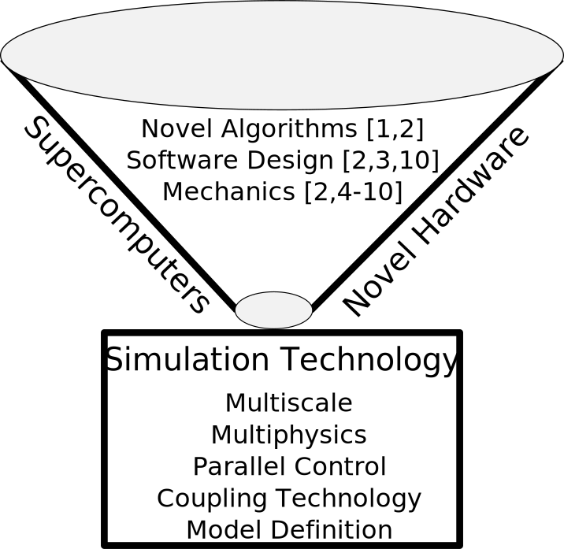

<!--  -->

My lab works with 3 main areas:

**Thrust 1:** Development of advanced simulation technologies and large-scale models for
supercomputers and emerging hardware to enable new science in biomechanics
and fusion reactor design.

**Thrust 2:** Abstractions and algorithms for coupling of multiscale and multiphysics codes.

**Thrust 3:** Improved methodologies for multiscale modeling fibrous materials.

Looking for motivated students! [Please contact me]().
